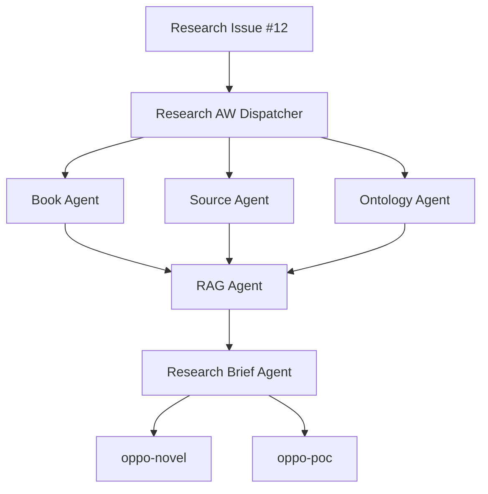
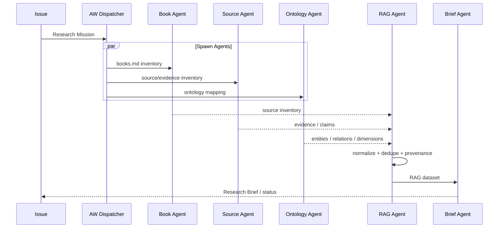
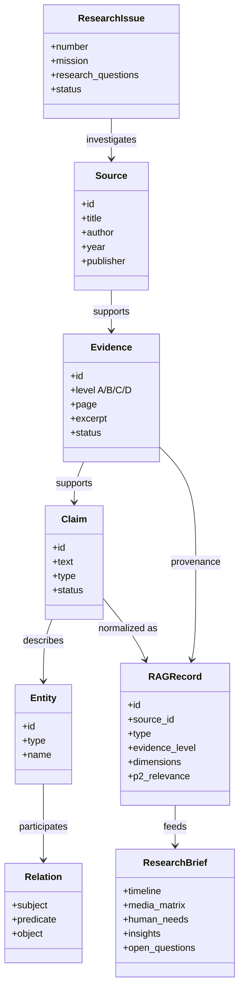
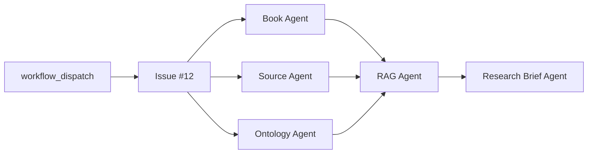

# Research AW UML

`oppo-research` の Research AW を、Issue を起点に複数の Agent が並列実行し、RAG と Research Brief に統合する構造として定義する。

## System

## Agent Sequence

## Domain Model

## GitHub Actions Deployment

Workflow:

`\.github/workflows/research-aw.yml`

The current implementation is intentionally lightweight. Agents establish the execution graph and workspace first; claim extraction, evidence verification, RAG generation, and Research Brief production are subsequent AW implementation steps.

## Architecture Rules

1. **Issue is the mission.**
2. **Agent is an execution role.**
3. **books.md is the source catalog.**
4. **Evidence keeps provenance.**
5. **Historical fact and hypothesis remain separate.**
6. **RAG is machine-readable research memory.**
7. **Research Brief is the handoff artifact.**
8. **Novel and PoC consume research; they do not own historical evidence.**

## Evidence Levels

| Level | Meaning |
|---|---|
| A | Primary / official / contemporaneous |
| B | Contemporaneous secondary source |
| C | Retrospective / first-person account |
| D | Hearsay / unverified |
